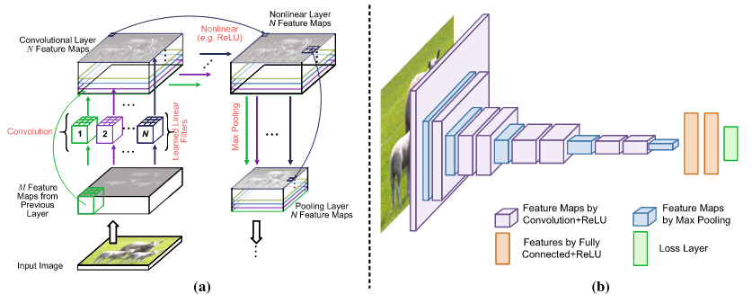

# Facial Recognition

## Abstract

To correctly identify and pair a human's expression.

## Detailed Description

Detailed description of your reseach with appropriate references.

### Datasets

I collected the data from GitHub. The size of the file is 1.95 GB. It contains 70,000 files, the format of which is PNG. The resolution of the files is 128x128. The link of the dataset is shared below.

https://drive.google.com/drive/folders/1tg-Ur7d4vk1T8Bn0pPpUSQPxlPGBlGfv

### Arcitecture Proposal

Description of the arcitecture you will use (include diagrams and references as appropriate).

## References
hello world
